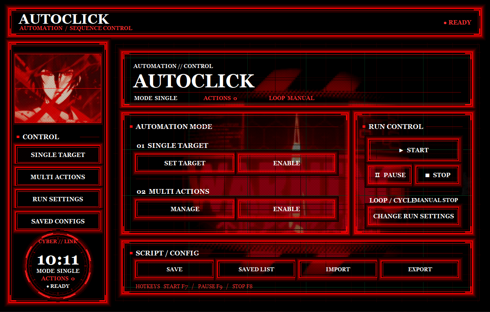
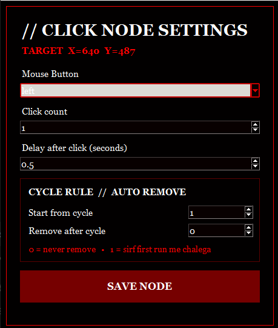
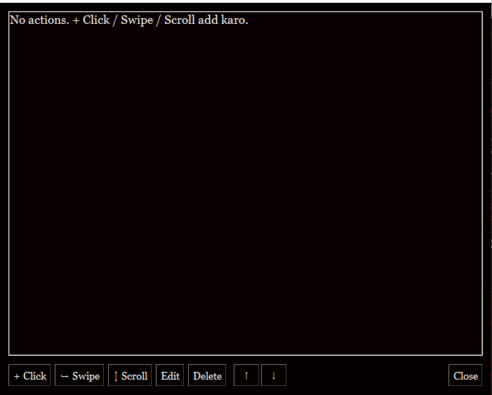
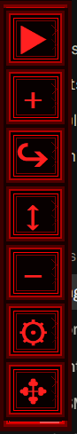
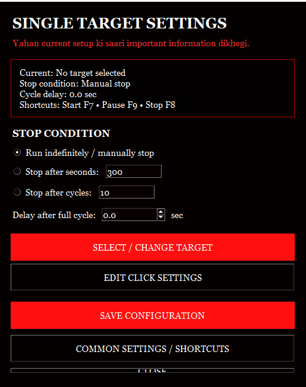

# AutoClick

AutoClick is a Windows desktop auto clicker built with Python and Tkinter. It clicks, scrolls and swipes at screen positions you choose, either on a single point or as a full sequence of actions that repeats in a loop.



## Features

- **Single Target mode:** repeat a click on one point.
- **Multi Actions mode:** run a sequence of clicks, scrolls and swipes in any order.
- **Per-action settings:** mouse button, click count, delay, scroll direction and amount, swipe duration.
- **Cycle rules:** make an action run only in certain cycles and skip the rest.
- **Stop conditions:** stop manually, after a number of seconds, or after a number of cycles.
- **Global hotkeys:** Start, Pause and Stop work even when another application is focused.
- **Floating toolbar:** a small always-on-top control strip, so the main window can stay hidden.
- **Target scope:** a red crosshair with live X/Y coordinates while you pick a point.
- **Save and load configs:** save a setup by name, load it later, or import and export it as JSON.

## Requirements

- Windows (the transparent overlays and Registry storage are Windows features)
- Python 3.8 or newer
- These packages:

```bash
pip install pyautogui pynput pillow
```

`tkinter` ships with Python. Pillow is optional: without it the app still runs, but the GIF backgrounds and window icon are not shown.

## Optional files

Place these in the same folder as the script (or the EXE). The app runs without them.

| File | Purpose |
|---|---|
| `hacker.gif` | Background animation of the main dashboard |
| `hacker1.gif` | Sidebar animation |
| `AutoClicker.jpg` | Window and taskbar icon |

## Running

```bash
python autoclick.py
```

Replace `autoclick.py` with the name of your script file.

## Usage

### Single Target mode

1. In the **SINGLE TARGET** row, press **ENABLE**.
2. The mouse turns into a crosshair. **Left click** where you want the click to happen. Press `ESC` to cancel.
3. Set the mouse button, click count and delay, then press **SAVE NODE**.
4. The floating toolbar appears. Press **▶** or `F7` to start.



### Multi Actions mode

1. In the **MULTI ACTIONS** row, press **ENABLE**. The floating toolbar appears.
2. Add actions from the toolbar: `+` for a click, `↪` for a swipe, `↕` for a scroll.
3. A swipe needs two clicks: first the start point, then the end point.
4. Press **MANAGE** to open the action list, where you can edit, delete and reorder actions.
5. Press **▶** or `F7` to start.



### Floating toolbar



| Button | Action |
|---|---|
| ▶ / ■ | Start / Stop |
| + | Add a click point |
| ↪ | Add a swipe (Multi mode only) |
| ↕ | Add a scroll (Multi mode only) |
| − | Remove the last action |
| ⚙ | Show the main window |
| ✥ | Drag to move the toolbar |

<br clear="right">

### Hotkeys

| Action | Default key |
|---|---|
| Start | `F7` |
| Pause / Resume | `F9` |
| Stop | `F8` |

To change them, open **RUN SETTINGS**, pick new keys and press **APPLY SHORTCUTS**. All three keys must be different.

### Stop condition and cycle delay

**SET TARGET** (or **SINGLE TARGET** in the sidebar) opens the settings window:



- **Run indefinitely:** runs until you stop it.
- **Stop after seconds:** stops after the given time.
- **Stop after cycles:** stops after the given number of cycles.
- **Delay after full cycle:** how long to wait after each complete cycle.

These settings apply to both modes.

### Cycle rules

A cycle is one full pass through all actions. Every action has two values:

- **Start from cycle:** the first cycle in which the action runs.
- **Remove after cycle:** the last cycle in which it runs. `0` means it never stops.

Example: a click that closes a popup is only needed once, so set `Remove after cycle = 1`. From cycle 2 onward that action is skipped automatically.

## Saving and loading configs

- **SAVE:** saves the current setup under a name. Saving with an existing name replaces it.
- **SAVED LIST:** load or delete saved configs.
- **EXPORT / IMPORT:** write the setup to a `.json` file or read it back, for example to move it to another PC.

Saved configs are stored in the Windows Registry at `HKEY_CURRENT_USER\Software\AutoClick` under the value `SavedConfigs`, so no extra file is created next to the EXE. If an old `saved_configs.json` is found, it is migrated to the Registry and removed. On other systems, configs are stored in `~/.autoclick_saved_configs.json`.

An exported file looks like this:

```json
{
  "name": "Config",
  "mode": "multi",
  "single_action": null,
  "actions": [
    {
      "type": "click",
      "x": 500, "y": 300,
      "button": "left",
      "clicks": 1,
      "delay": 0.5,
      "start_cycle": 1,
      "end_cycle": 0
    },
    {
      "type": "scroll",
      "x": 500, "y": 400,
      "amount": -5,
      "delay": 0.5,
      "start_cycle": 1,
      "end_cycle": 0
    },
    {
      "type": "swipe",
      "x1": 200, "y1": 600,
      "x2": 800, "y2": 600,
      "duration": 0.5,
      "delay": 0.5,
      "start_cycle": 1,
      "end_cycle": 0
    }
  ],
  "loop_mode": "infinite",
  "duration_seconds": 300,
  "cycles": 10,
  "cycle_delay": 0.0,
  "start_hotkey": "F7",
  "pause_hotkey": "F9",
  "stop_hotkey": "F8"
}
```

A negative `amount` scrolls down, a positive one scrolls up.

## Safety

- Moving the mouse to the **top-left corner** of the screen stops the automation immediately (PyAutoGUI failsafe).
- `F8` stops it at any time.
- Target markers are removed while the automation runs, so clicks land on the real screen and not on a marker.

## How the code works

| Part | Role |
|---|---|
| `AutoClickerApp` | Main class. Builds the dashboard, holds the settings and starts or stops the automation. |
| `TargetSelector` | Full-screen transparent overlay. The crosshair follows the mouse and captures the exact X/Y of the click. |
| `TargetMarker` | Small red scope drawn on each saved point. It is click-through, so mouse clicks pass through it. |
| `FloatingToolbar` | The always-on-top button strip. |
| `ClickSettings`, `ScrollSettings`, `SwipeSettings` | Settings dialog for each action type. |
| `CanvasGifPlayer`, `AnimatedGifSurface` | Play the GIF animations (visual only). |
| `NeonButton` | Custom button with a neon border. |

Automation flow:

1. On **Start**, `snapshot_settings()` takes a copy of the current settings and actions.
2. A separate thread (`worker_loop`) runs the automation so the window stays responsive.
3. In each cycle the thread runs the actions in order. `action_active_for_cycle()` decides whether an action runs in that cycle.
4. `execute_action()` does the real work with `pyautogui.click`, `pyautogui.scroll` or `pyautogui.dragTo`.
5. Pause and Stop are checked even during delays (`interruptible_sleep`).
6. `pynput` listens for the hotkeys and puts events on a queue, which the main window reads every 80 ms.
7. When the thread ends, `worker_finished()` redraws the markers and sets the status back to READY.

## Building an EXE (optional)

The code is ready for PyInstaller (`resource_path()` finds the bundled files):

```bash
pip install pyinstaller
pyinstaller --onefile --windowed --icon=AutoClicker.ico --add-data "hacker.gif;." --add-data "hacker1.gif;." --add-data "AutoClicker.jpg;." autoclick.py
```

The EXE is created in the `dist` folder. To change a GIF or the icon later, put a new file with the same name next to the EXE; the app uses that one first.
